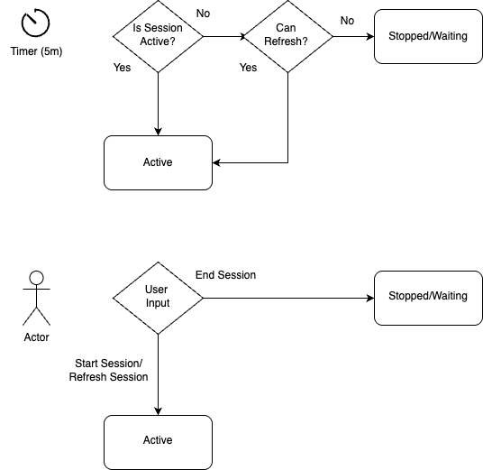

# OCI Sesssion Manager
OCI session manager is a tool to manage OCI token authentication sessions. 

I've noticed that auth sessions typically expire after about an hour. I got tired of manually doing a session authenticate command several times a day. 
This utility puts an icon in your menubar using [Xbar](https://github.com/matryer/xbar)

Recommend setting the refresh interval to about 5-10 mins.
## Getting Started
1. install xbar from https://github.com/matryer/xbar/releases
2. install pre-requisite OCI CLI command:
   https://docs.oracle.com/en-us/iaas/Content/API/SDKDocs/cliinstall.htm
3. Symlink this script into the xbar plugins directory
  `ln -s scripts/session.sh ~/Library/Application\ Support/xbar/plugins/session.5m.sh`

  should look like this:
  ```
  session.10m.sh -> $HOME/Development/session_manager/scripts/session.sh
  ```
4. You can then start a new session using OCI-> Actions -> Start Session. If a session is already running,
   it will automatically be refreshed.

## User Inputs
There are three options to manually manage sessions. 
1. Start Session. This creates a new OCI CLI token auth session.
2. Refresh Session. This attempts to refresh an existing OCI CLI token auth session.
3. End Session. This removes the token file for the DEFAULT session from  `$HOME/.oci/sessions/DEFAULT/token
 
## State diagram
